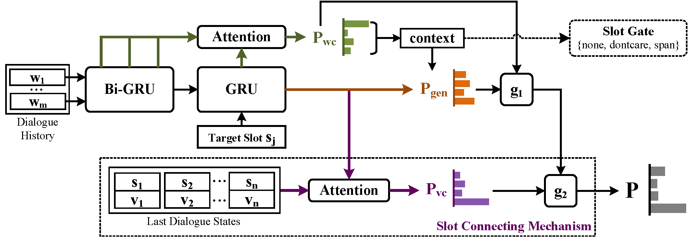

# DST-SC
This repository is the implementation of [Dialogue State Tracking with Explicit Slot Connection Modeling](https://www.aclweb.org/anthology/2020.acl-main.5).


## Requirements
Install requirements:
```bash
pip install -r requirements.txt
```

Other preparations:
- Unzip `dataset/multiwoz.zip`
- Download [character embedding](https://www.logos.t.u-tokyo.ac.jp/~hassy/publications/arxiv2016jmt/jmt_pre-trained_embeddings.tar.gz) and unzip `charNgram.txt` to the `embedding` folder.


## Training
To train the model in the paper, run this command:
```bash
python run.py --dataset=2.0 --gpu=0,1,2 --batch_size=6 --gas=2
```


## Evaluation
To evaluate the model, specify your saved checkpoint file in `train.py` first and run:
```bash
python run.py --dataset=2.0 --is_test=True
```


## Model



## Results
Our model achieves the following performance on [MultiWOZ 2.0](https://arxiv.org/abs/1810.00278) and [2.1](https://arxiv.org/abs/1907.01669) dataset:
| Model  | MultiWOZ 2.0 | MultiWOZ 2.1 |
| ------ | ------------ | ------------ |
| DST-SC | 52.24%       | 49.58%       |


## Citation
> Dialogue State Tracking with Explicit Slot Connection Modeling. Yawen Ouyang, Moxin Chen, Xinyu Dai, Yinggong Zhao, Shujian Huang and Jiajun Chen. ACL 2020.